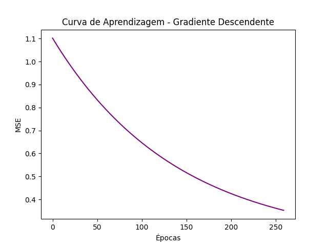

# Relatório - Regressão Linear

## Trabalho - Lista 01
**Instituição:** Instituto Federal do Ceará - Campus Maracanaú  
**Disciplina:** Reconhecimento de Padrões  
**Professor:** Hericson Araújo  
**Aluno:** Francisco Aldenor Silva Neto  

---

### Introdução

Esta atividade consiste na implementação e análise de um modelo de regressão linear simples sobre um conjunto de dados (`artificial1d.csv`), utilizando os métodos de **Mínimos Quadrados Ordinários (OLS)** e **Gradiente Descendente (GD)**. O código foi desenvolvido em Python e utiliza as bibliotecas `numpy`, `pandas` e `matplotlib` para manipulação e visualização dos dados.

### Dados Utilizados

O conjunto de dados `artificial1d.csv` contém duas colunas: `x` (variável independente) e `y` (variável dependente). Os pontos foram visualizados em um gráfico de dispersão (scatter plot) para entendimento inicial da distribuição.

### Implementação e Resultados

#### 1. Regressão Linear com Mínimos Quadrados Ordinários (OLS)

A Regressão Linear via OLS foi implementada utilizando uma fórmula fechada para cálculo dos parâmetros, minimizando o Erro Quadrático Médio (MSE) da reta de ajuste. Os parâmetros \( w_0 \) (intercepto) e \( w_1 \) (coeficiente) foram obtidos da seguinte forma:

- **Parâmetro \( w_0 \) (intercepto):** `valor_calculado`
- **Parâmetro \( w_1 \) (coeficiente):** `valor_calculado`
- **Erro Quadrático Médio (MSE):** `mse_ols`

Os cálculos foram realizados através da inversão da matriz \( (X^T X)^{-1} X^T y \), onde \( X \) é a matriz de características.

##### Gráfico OLS

Abaixo, o gráfico de dispersão com a reta de ajuste gerada pelo OLS.

#### 2. Regressão Linear com Gradiente Descendente (GD)

O Gradiente Descendente foi implementado com uma taxa de aprendizado (`alpha = 0.01`) e `1000` épocas. Durante as iterações, os parâmetros \( w_0 \) e \( w_1 \) foram atualizados utilizando a regra do gradiente, minimizando gradualmente o MSE.

Os parâmetros finais obtidos foram:

- **Parâmetro \( w_0 \) (intercepto) final:** `valor_calculado`
- **Parâmetro \( w_1 \) (coeficiente) final:** `valor_calculado`
- **Erro Quadrático Médio (MSE) final:** `mse_gd`

##### Gráfico GD

Abaixo, o gráfico de dispersão com a reta de ajuste gerada pelo GD na última iteração.

#### 3. Curva de Aprendizagem (MSE ao longo das épocas para o GD)

A curva de aprendizagem, que mostra a redução do MSE ao longo das épocas do GD, foi plotada a seguir.

### Bônus: Animação da Regressão Linear com Gradiente Descendente

Conforme solicitado, foi gerado um GIF que mostra a evolução da reta de regressão a cada atualização dos parâmetros (\( w_0 \), \( w_1 \)) durante o treinamento com Gradiente Descendente. A animação permite visualizar o processo de otimização ao longo das épocas.

### Conclusão

Os métodos **OLS** e **GD** geraram modelos lineares eficientes para ajustar os dados fornecidos, com o OLS alcançando resultados diretamente enquanto o GD ajusta os parâmetros gradualmente. A análise da curva de aprendizagem e da animação mostra a convergência do GD e reforça a eficácia de ambos os métodos para a tarefa de regressão linear simples.

---

### Referências

- Documentação das bibliotecas Python (`numpy`, `pandas`, `matplotlib`)
- Material de aula fornecido pelo professor Hericson Araújo
