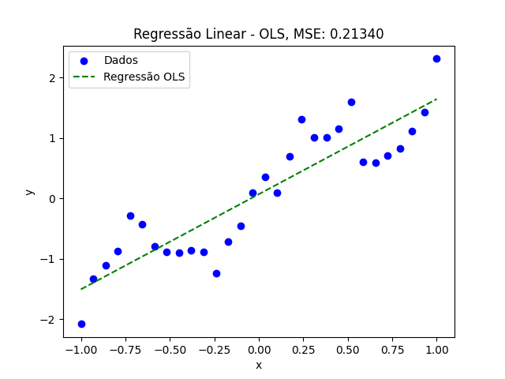
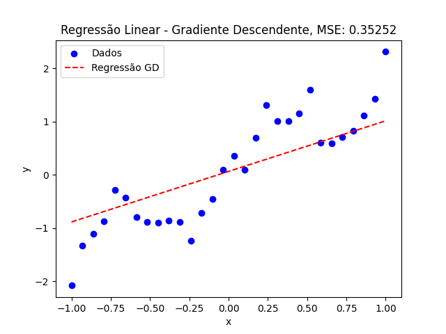
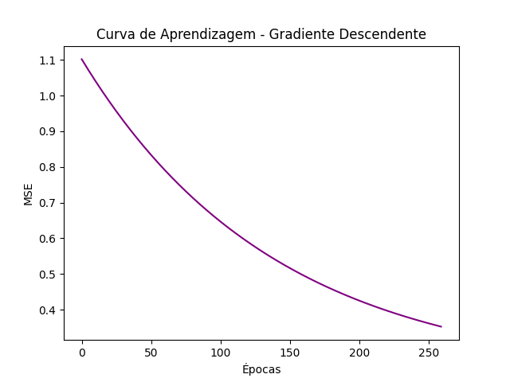

# Relatório - Regressão Linear

## Trabalho - Lista 01
**Instituição:** Instituto Federal do Ceará - Campus Maracanaú  
**Disciplina:** Reconhecimento de Padrões  
**Professor:** Hericson Araújo  
**Aluno:** Francisco Aldenor Silva Neto  

---

### Introdução

Este trabalho aborda a implementação e análise de um modelo de regressão linear simples sobre um conjunto de dados artificial, utilizando dois métodos: **Mínimos Quadrados Ordinários (OLS)** e **Gradiente Descendente (GD)**. A programação foi realizada em Python com as bibliotecas `numpy`, `pandas` e `matplotlib`, visando manipulação de dados e visualização gráfica.

### Dados Utilizados

O conjunto de dados `artificial1d.csv` contém duas colunas:
- **x** (variável independente)
- **y** (variável dependente)

Os dados foram inicialmente visualizados em um gráfico de dispersão para identificar o comportamento geral da relação entre `x` e `y`.

### Implementação e Resultados

#### 1. Regressão Linear com Mínimos Quadrados Ordinários (OLS)

Na regressão via OLS, o objetivo é encontrar os parâmetros que minimizam o **Erro Quadrático Médio (MSE)** da reta ajustada aos dados. Utilizou-se a seguinte fórmula para calcular os parâmetros:

\[
w = (X^T X)^{-1} X^T y
\]

onde $X$ é a matriz de características com uma coluna de `1's` (para o intercepto $w_0$) e a coluna de `x` (para o coeficiente $w_1$).

- **Parâmetro $w_0$ (intercepto):** 0.0676
- **Parâmetro $w_1$ (coeficiente):** 1.5749
- **Erro Quadrático Médio (MSE):** 0.2134

Esses parâmetros indicam que o modelo consegue capturar bem a tendência linear do conjunto de dados.

##### Gráfico OLS

Abaixo, o gráfico de dispersão com a reta de ajuste calculada pelo método OLS.

#### 2. Regressão Linear com Gradiente Descendente (GD)

Para a regressão com Gradiente Descendente, o modelo é ajustado iterativamente através de uma taxa de aprendizado ($\alpha = 0.01$) e um número máximo de `1000` épocas. Em cada época, os parâmetros $w_0$ e $w_1$ são atualizados para minimizar o MSE com base na derivada dos erros. O critério de parada ocorre quando a variação do MSE entre épocas consecutivas é menor que uma tolerância ($\text{tol} = 0.001$).

Durante a execução, foram geradas imagens da reta ajustada a cada 10 épocas para demonstrar a convergência visual do modelo.

##### Parâmetros finais

- **Parâmetro $w_0$ (intercepto) final:** 0.0627
- **Parâmetro $w_1$ (coeficiente) final:** 0.9523
- **Último Erro Quadrático Médio (MSE):** 0.3525
- **Convergência atingida na época:** 259

##### Gráfico GD

Abaixo, o gráfico de dispersão com a reta ajustada pelo GD na última iteração.

#### 3. Curva de Aprendizagem (MSE ao longo das épocas para o GD)

A curva de aprendizagem foi gerada para visualizar o MSE em função do número de épocas no processo de Gradiente Descendente. A curva demonstra que o erro diminui gradualmente, convergindo até atingir o critério de parada na época `259`, quando a diferença entre os MSEs consecutivos é menor que a tolerância.

### Conclusão

Ambos os métodos, **OLS** e **GD**, mostraram-se eficientes para ajustar o modelo de regressão linear ao conjunto de dados artificial. O OLS oferece uma solução direta e rápida ao calcular os parâmetros por meio de uma fórmula fechada, resultando em um MSE mais baixo comparado ao GD. Já o Gradiente Descendente requer um ajuste iterativo dos parâmetros, o que o torna mais flexível e visualmente interessante para acompanhar o processo de otimização, mesmo que leve mais tempo para convergir e tenha um MSE final um pouco maior.

A curva de aprendizagem gerada reforça a compreensão do comportamento do GD ao longo das iterações e ilustra como a convergência foi obtida. Em aplicações de regressão linear simples, ambos os métodos são válidos, sendo o OLS mais indicado para datasets menores e o GD mais flexível para grandes volumes de dados ou problemas em que a fórmula fechada não é aplicável.

### Referências

- Repositório do projeto no GitHub: [Regressão Linear OLS e GD](https://github.com/Aldenor-Neto/Regressao-linear-OLS-e-GD-)  

